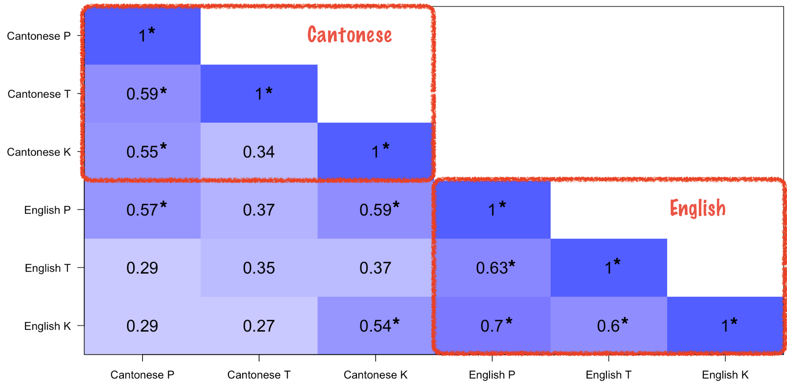
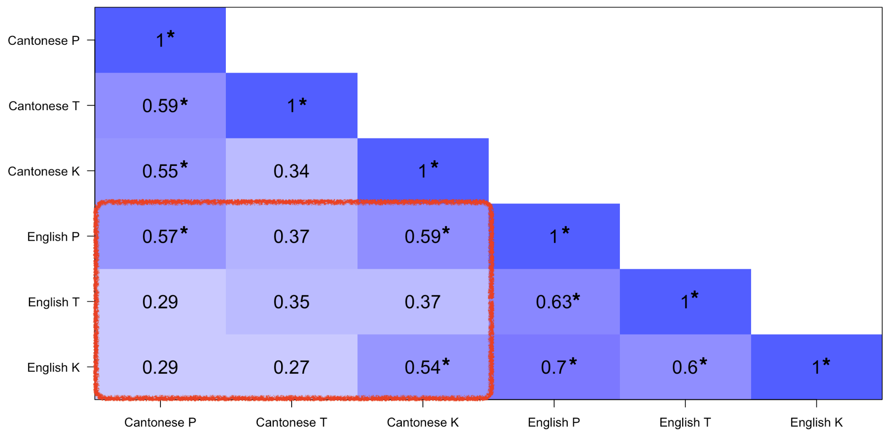

layout: true
class: left, top

<div class="footer">
<a href="https://twitter.com/khia_johnson">`r fa('twitter', fill ='#00A7E1')` <tt>@khia_johnson</tt></a> | #Interspeech2021 | Leveraging the uniformity framework | Paper ID 1780
</div>

---
class:middle,center
```{r setup, include=FALSE}
library(fontawesome)
library(tidyverse)
library(ggthemes)

options(htmltools.dir.version = FALSE)
knitr::opts_chunk$set(
  fig.width=9, fig.height=3.5, fig.retina=3,
  out.width = "100%",
  cache = FALSE,
  echo = TRUE,
  message = FALSE, 
  warning = FALSE,
  fig.show = TRUE,
  hiline = TRUE
)

theme_set(theme_clean() + theme(
      legend.title = element_text(face = 'bold', size=10),
      legend.text = element_text(size=10),
      legend.position = 'bottom',
      axis.title.x = element_text(size = 10, face='bold'),
      axis.title.y = element_text(size = 10, face='bold'),
      strip.text = element_text(size=10, face='bold'),
      plot.background = element_blank()
    ))

library(xaringanthemer)
style_duo(
  primary_color = "#ffffff", 
  secondary_color = "#002145",
  text_font_google   = google_font("Montserrat", "400", "400i"),
  code_font_google   = google_font("Fira Mono"),
  header_h1_font_size = '3rem',
  header_h2_font_size = '2.25rem',
  header_h3_font_size = '1.75rem',
  text_font_size = '1.25rem',
  text_color = '#002145',
  code_inline_color = '#00A7E1',
  link_color = '#00A7E1'
)

# extra_css <- list(
#   ".small" = list("font-size" = "80%"),
#   ".big" = list("font-size" = "150%"),
#   ".header" = list("position" = "absolute", "bottom" = "12px", "left"="20px", "font-size" = "80%")
# )
# style_extra_css(css = extra_css, outfile = "custom.css")
```

## Leveraging the uniformity framework to examine crosslinguistic similarity for long-lag stops in spontaneous Cantonese-English bilingual speech

#### Khia A. Johnson

Department of Linguistics<br>University of British Columbia

Interspeech 2021 | Paper ID 1780
---
class:middle
## Do highly similar speech sounds from different langauges arise from the same underlying category?
<br><br>&nbsp;

???
Crosslinguistic influence is widespread at phonetic level, but most of the work is based on research with phonologically similar sounds that are phonetically distinct. A classic example of this is English long lag k, compared to a Spanish short lag k. Same place in the inventory, different laryngeal gesture. This allows you to physically tell the two sounds apart.

How do you asses that things are indeed similar to each other. How do you tell them together? Because things that are the most alike already have the most potential for sharing a mental representation, or quote "being the same."


---

<br> 
## The SpiCE Corpus
### Speech in Cantonese & English

.pull-left[

- Casual interview data

- 34 early bilingual talkers

- Sample of **9,458** long-lag stops 
]

.pull-right[
Documentation: <br><https://spice-corpus.readthedocs.io>


]


???
The data set here comes from the SpiCE of speech in cantonese and english. 
It contains casual interviews between bilingual peers in both languages-- so its within-talker data.
We collected a sample from the corpus of all the word-initial pre-vocalic long lag stops
After filtering for measurement error and that sort of thing, we were left with just under 10k stops

---

<br>

## Identifying *uniform* structure in phonetic variation:

- Ordinal relationships

- Correlations

- Mixed effects model


---

<br> 

## Relatively few talkers show expected ordinal relationship for mean VOT

<br>
.left[
.big[
| Language  | P < T | T < K | P < K | 
| --------- | -------- | ----- | ------ | 
| Cantonese &nbsp;&nbsp; | 0.24 ❌  &nbsp;&nbsp; | 0.61 🤷 &nbsp;&nbsp; | 0.49 🤷 |
| English &nbsp;&nbsp;   | 0.82 ✅  &nbsp;&nbsp; | 0.06 ❌ &nbsp;&nbsp; | 0.47 🤷 |
]
]


???


---

<br>

## Within language correlations show *some* uniformity

.center[

]


???

---

<br>

## Across language correlations show *very little* uniformity

.center[

]

???

---

<br>
## The takeaway? It's murky.

- Less structure to VOT variation than anticipated

- Mixed effect model indicates English T/K have consistently longer VOT

- Implications for multilingual representation


???


